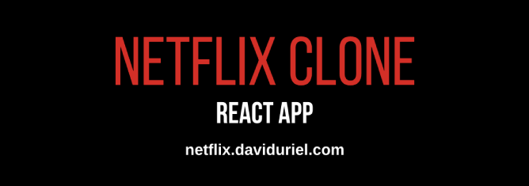
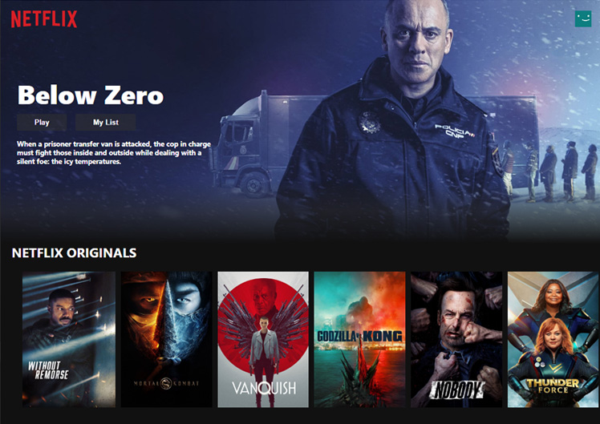

<h1 align="center">Netflix Clone React App</h1>


<h2 align="center"><a  href="https://netflix.daviduriel.com">Live Demo</a></h2>

## Description

This is a Netflix Clone that was created to mimic the style and feel of Netflix. You can browse current movie trailers in certain categories using a UI very similar to Netflix.

<p align="center"></p>

## About The Project

This clone built using React and Material-UI. This application uses OMDb API to obtain movie information and links to movie trailers from YouTube.

## Project Setup

```
npm install
npm start
```
